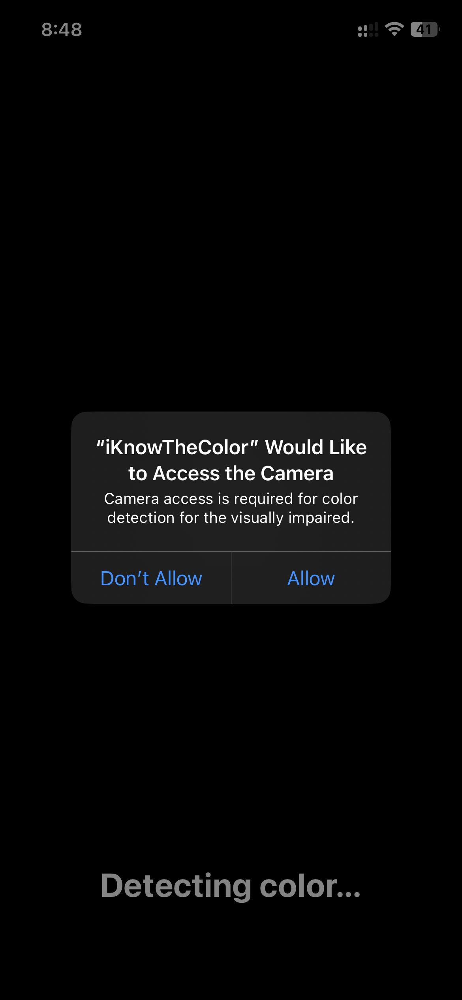

# iKnowTheColor


This application is designed to **assist blind and visually impaired individuals** by identifying colors of objects in real time using the device’s camera. It provides **instant voice feedback**, ensuring users can understand and interact with their surroundings more independently.

---

## Screenshots

<p align="center">
  
  
</p>

---

## Features

* **Tap to Identify** – Simply tap anywhere on the screen to detect the color at that point.
* **Voice Feedback** – The app announces the detected color name immediately.
* **Optimized for Accessibility** – Simple, clutter-free interface designed for visually impaired users.
* **Enhanced Accuracy** – Uses a custom HSV (Hue, Saturation, Value) algorithm to classify colors beyond simple RGB thresholds.
* **Real-time Detection** – Minimal delay between tap and spoken result.

## Requirements

* iOS 16.0 or later
* iPhone with a working camera
* Voice output capabilities enabled (e.g., device not muted)

## Installation

1. Clone the repository:
   ```bash
   git clone https://github.com/seahpark247/iKnowTheColor.git
   cd iKnowTheColor
2. Open the project in Xcode:
   ```bash
   open iKnowTheColor.xcodeproj
3. Build and run the application on your device.

## How to Use
1. Launch the app.
2. Point your camera at any object or surface.
3. Tap the screen to hear the detected color name.
4. Use accessibility gestures for additional functions (e.g., VoiceOver navigation).

## Technologies
* **Swift** for iOS development
* **AVFoundation** for speech synthesis
* **Custom HSV Color Detection Algorithm** for reliable color classification
* **SwiftUI** with full Accessibility API integration
